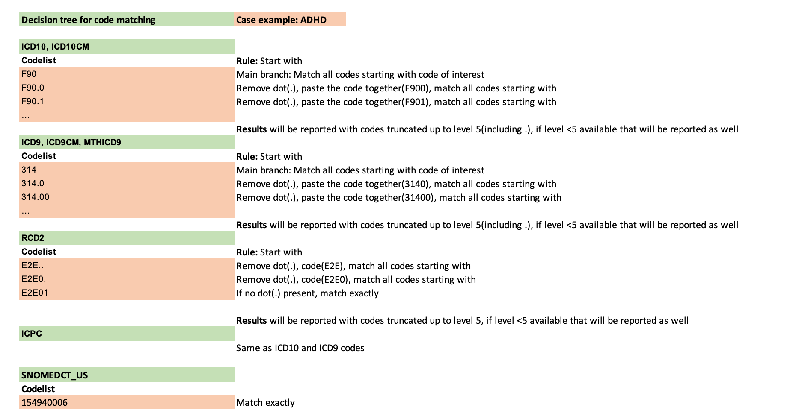

```{css,  echo = F}
/*-- Specify div's for 'boxes', change color of TOC and center align titles: --*/
div.box1 {background-color: #f5f5f0; border-radius: 5px; padding: 30px; margin-right: 0px}
div.box2 {border-style: solid; border-color: #f5f5f0; border-width: medium; border-radius: 30px; padding: 5px; margin-right: 0px}
div.box3 {border-style: solid; border-color: #f5f5f0; border-width: medium; border-radius: 30px; padding: 5px; margin-right: 0px}
div.box4 {border-style: solid; border-color: #f5f5f0; border-width: medium; border-radius: 30px; padding: 5px; margin-right: 0px}
div.box5 {border-style: solid; border-color: #f5f5f0; border-width: medium; border-radius: 30px; padding: 5px; margin-right: 0px}
div.box6 {border-style: solid; border-color: #f5f5f0; border-width: medium; border-radius: 30px; padding: 5px; margin-right: 0px}
div.box7 {border-style: solid; border-color: #f5f5f0; border-width: medium; border-radius: 30px; padding: 5px; margin-right: 0px}
div.box8 {border-style: solid; border-color: #f5f5f0; border-width: medium; border-radius: 30px; padding: 5px; margin-right: 0px}
div.box9 {border-style: solid; border-color: #f5f5f0; border-width: medium; border-radius: 30px; padding: 5px; margin-right: 0px}

.list-group-item.active, .list-group-item.active:focus, .list-group-item.active:hover {background-color: #76b82a; border-color: #76b82a}
h1 {text-align: center; color: #3c7b8a}
h2 {text-align: center; color: #76b82a}

/*-- Add logo (based on https://rstudio4edu.github.io/rstudio4edu-book/rmd-fancy.html): --*/
#TOC::before {content: ""; display: block; height: 60px; margin: 30px 10px 30px; background-image: url("conception_logo.png"); background-size: contain; background-position: center center; background-repeat: no-repeat}
```

```{r set_locale, include=FALSE}
Sys.setlocale("LC_ALL", "C")
`%!in%` = Negate(`%in%`)
```

<div class = 'box1'>

**Level 3:** Diagnoses counts and rates in the study population and in females of childbearing age (12-55 years old)  

<br> 

The analysis contains the following steps:


The codelist algorithm is explained below:

<br>



<br>

Time lag between two diagnoses is as follows:

For chronic conditions and not applicable condition rates of first events only will be reported.   

<br>


<br>

If subpopulations are available in your data the analysis will be performed separately for each subpopulation.
In case there is an overlapping subpopulation only subjects in the overlap period will be taken into account.
***Example:***

<br>


`year` is retrieved from `start_date_record` for the **EVENTS** table, `mo_date` for the **MEDICAL_OBSERVATIONS** table and `so_date` for **SURVEY_OBSERVATIONS** table.

</div>

<br>

<div class = 'box2'>


## 1. Flowchart
<br> 

```{r echo=F}
if (subpopulations_present=="No"){
flowchart<-fread(paste0(diag_dir,"Masked/", "diagnoses_flowchart_masked.csv"))
datatable(flowchart, options = list(scrollX=T))
} else {
flowchart<-fread(paste0(diag_dir,subpopulations_names[a], "/Masked/", subpopulations_names[a],"_diagnoses_flowchart_masked.csv"))
datatable(flowchart, options = list(scrollX=T))
}
```


</div>

<br>

<div class = 'box3'>

## 2. Description of diagnoses_study_population

<br> 

```{r echo=F}
if (subpopulations_present=="No"){
description<-fread(paste0(diag_dir,"Masked/", "diagnoses_description_masked.csv"))
datatable(description, options = list(scrollX=T))
} else {
  description<-fread(paste0(diag_dir,subpopulations_names[a], "/Masked/", subpopulations_names[a],"_diagnoses_description_masked.csv"))
datatable(description, options = list(scrollX=T))
}
```

</div>


<br>

<div class = 'box4'>

## 3. Missingness of diagnoses codes

<br> 

```{r echo=F}
if (subpopulations_present=="No"){
  if(sum(grepl(list.files(paste0(diag_dir,"Masked/")), pattern="diagnoses_completeness_masked.csv"))>0){
tab20<-fread(paste0(diag_dir,"Masked/", "diagnoses_completeness_masked.csv"))
if(tab20[,.N]>0){
datatable(tab20, options = list(scrollX=T))
  } else {
    tab20<-NULL
  print("This table cannot be produced based on the available data.")
  }
} else {
  tab20<-NULL
  print("This table cannot be produced based on the available data.")
}
} else {
    if(sum(grepl(list.files(paste0(diag_dir,subpopulations_names[a], "/Masked/")), pattern="diagnoses_completeness_masked.csv"))>0){
    tab20<-fread(paste0(diag_dir,subpopulations_names[a], "/Masked/", subpopulations_names[a],"_diagnoses_completeness_masked.csv"))
    if(tab20[,.N]>0){
datatable(tab20, options = list(scrollX=T))
    } else {
      tab20<-NULL
    print("This table cannot be produced based on the available data.") 
    }
  } else {
    tab20<-NULL
    print("This table cannot be produced based on the available data.")
  }
}
```

A count smaller than 5(counts between 1 and 4) will be represented in the graphs with a value of 0.9 for easy comparison. Counts of 0 are not plotted. If a category is missing in the plot, it means that it had a count of zero.

```{r tab20_graph, echo=F}
if(!is.null(tab20)){
tab20_graph<-tab20[no_records=="<5", no_records:= 0.9]
tab20_graph<-tab20_graph[,no_records:=as.numeric(no_records)]
tab20_graph<-tab20[no_empty_code=="<5", no_empty_code:= 0.9]
tab20_graph<-tab20_graph[,no_empty_code:=as.numeric(no_empty_code)]
} else {
 tab20_graph<-NULL 
}


if(!is.null(tab20)){
# Compute the cumulative percentages (top of each rectangle)
  tab20_graph[,year:=as.factor(year)]
  
ggplot(tab20_graph, aes(fill=year, y=percentage_empty_code, x=meaning, label= percentage_empty_code)) + 
  geom_bar(position="stack", stat="identity") +
  geom_text(size=3, position=position_stack(vjust=0.5)) +
    ggtitle("Diagoses completeness information") +
    xlab("") + 
  ylab("Percentage") +
  theme(axis.text.y = element_blank(),
        axis.ticks.y = element_blank(),
        axis.text.x=element_text(angle = 90),
        plot.title = element_text(color="#76b82a", face="bold"))
  }

```
<br>

</div>

<br>

<div class = 'box5'>

## 4. Code count by meaning and event definition

<br> 

```{r echo=F}
if (subpopulations_present=="No"){
  if(sum(grepl(list.files(paste0(diag_dir,"Masked/")), pattern="diagnoses_counts_m_masked.csv"))>0){
tab21<-fread(paste0(diag_dir,"Masked/", "diagnoses_counts_m_masked.csv"))
if(tab21[,.N]>0){
setcolorder(tab21, c("event_definition","truncated_code","no_records","total_records","meaning","vocabulary","data_access_provider","data_source"))
datatable(tab21, options = list(scrollX=T))
} else {
  tab21<-NULL
  print("This table cannot be produced based on the available data.")
}
  } else {
    tab21<-NULL
  print("This table cannot be produced based on the available data.") 
}
} else {
    if(sum(grepl(list.files(paste0(diag_dir,subpopulations_names[a], "/Masked/")), pattern="diagnoses_counts_m_masked.csv"))>0){
    tab21<-fread(paste0(diag_dir,subpopulations_names[a], "/Masked/", subpopulations_names[a],"_diagnoses_counts_m_masked.csv"))
    if(tab21[,.N]>0){
    setcolorder(tab21, c("event_definition","truncated_code","no_records","total_records","meaning","vocabulary","data_access_provider","data_source"))
datatable(tab21, options = list(scrollX=T))
    } else {
      tab21<-NULL
  print("This table cannot be produced based on the available data.")  
    }
  } else {
    tab21<-NULL
    print("This table cannot be produced based on the available data.")
  }
}
```

<br>

</div>

<br>

<div class = 'box6'>

## 5. Rates of events

#### Rates of recurrent events by year, sex and age band

```{r rates_year_rec, echo=F}
if (subpopulations_present=="No"){
  if(sum(grepl(list.files(paste0(diag_dir,"Masked/")), pattern="diagnoses_rates_recurrent_masked.csv"))>0){
tab22<-fread(paste0(diag_dir,"Masked/", "diagnoses_rates_recurrent_masked.csv"))
if (tab22[,.N]>0){
  setcolorder(tab22, c("event_definition","sex","meaning","age_band","year","no_records","person_years","rate_per_1000_py"))
datatable(tab22, options = list(scrollX=T))
} else {
    print("This table cannot be produced based on the available data.")
}
  } else {
    print("This table cannot be produced based on the available data.")
}
} else {
    if(sum(grepl(list.files(paste0(diag_dir,subpopulations_names[a], "/Masked/")), pattern="diagnoses_rates_recurrent_masked.csv"))>0){
  tab22<-fread(paste0(diag_dir,subpopulations_names[a], "/Masked/", subpopulations_names[a],"_diagnoses_rates_recurrent_masked.csv"))
  if (tab22[,.N]>0){
    setcolorder(tab22, c("event_definition","sex","meaning","age_band","year","no_records","person_years","rate_per_1000_py"))
datatable(tab22, options = list(scrollX=T))
  } else {
      print("This table cannot be produced based on the available data.")
  }
    } else {
    print("This table cannot be produced based on the available data.")
    }
}
```

<br>

#### Rates of first event by year, sex and age band

```{r rates_year_first, echo=F}
if (subpopulations_present=="No"){
  if(sum(grepl(list.files(paste0(diag_dir,"Masked/")), pattern="diagnoses_rates_first_masked.csv"))>0){
tab23<-fread(paste0(diag_dir,"Masked/", "diagnoses_rates_first_masked.csv"))
if (tab23[,.N]>0){
  setcolorder(tab23, c("event_definition","sex","meaning","age_band","year","no_records","person_years","rate_per_1000_py"))
datatable(tab23, options = list(scrollX=T))
} else {
    print("This table cannot be produced based on the available data.")
}
  } else {
    print("This table cannot be produced based on the available data.")
}
} else {
    if(sum(grepl(list.files(paste0(diag_dir,subpopulations_names[a], "/Masked/")), pattern="diagnoses_rates_first_masked.csv"))>0){
  tab23<-fread(paste0(diag_dir,subpopulations_names[a], "/Masked/", subpopulations_names[a],"_diagnoses_rates_first_masked.csv"))
  if (tab23[,.N]>0){
setcolorder(tab23, c("event_definition","sex","meaning","age_band","year","no_records","person_years","rate_per_1000_py"))
datatable(tab23, options = list(scrollX=T))
  } else {
      print("This table cannot be produced based on the available data.")
  }
    } else {
    print("This table cannot be produced based on the available data.")
    }
}
```

<br>

</div>

<br>

<div class = 'box7'>

## 5. Codelist: Event definition

<br> 

```{r echo=F}
codes<-fread(paste0(output_dir,"Info/","data_characterisation_codelist.csv"))
datatable(codes, options = list(scrollX=T))
```

</div>

<br>

<div class = 'box8'>

## 6. References

<br>

**1.** Alessandri, M., Thorp, D., Mundy, P., & Tuchman, R. F. (2005). [Can we cure autism? From outcome to intervention]. Revista De Neurologia.    
**2.** A. T. F. (2013). Recurrence of major depressive disorder across different treatment settings: Results from the NESDA study. Journal of Affective Disorders, 147(1), 225–231.    
**3.** Bullock, J., Rizvi, S. A. A., Saleh, A. M., Ahmed, S. S., Do, D. P., Ansari, R. A., & Ahmed, J. (2018). Rheumatoid Arthritis: A Brief Overview of the Treatment. Medical Principles and Practice, 27(6), 501–507.    
**4.** Gohil, K. (2015). Multiple Sclerosis: Progress, but No Cure. P & T.: A Peer-Reviewed Journal for Formulary Management, 40(9), 604–605.    
**5.** Hardeveld, F., Spijker, J., Graaf, R. D., Hendriks, S. M., Licht, C. M. M., Nolen, W. A., Penninx, B. W.J.H., Beekman, A. T. F. (2013). Recurrence of major depressive disorder across different treatment settings: Results from the NESDA study. Journal of Affective Disorders, 147(1), 225–231.    
**6.** Kalra, A. A., & Elliott, D. (2007). Acute migraine: Current treatment and emerging therapies. Therapeutics and Clinical Risk Management, 3(3), 449–459.    
**7.** Klein, P., & Tyrlikova, I. (2020). No prevention or cure of epilepsy as yet. Neuropharmacology, 168, 107762.    
**8.** Matcho, A., Ryan, P., Fife, D., Gifkins, D., Knoll, C., & Friedman, A. (2018). Inferring pregnancy episodes and outcomes within a network of observational databases. PLOS ONE, 13(2).    
**9.** Rosario, C., Seguro, L., Vasconcelos, C., & Shoenfeld, Y. (2013). Is there a cure for systemic lupus erythematosus. Lupus, 22(5), 417–421.    
**10.** Wilens, T. E., & Spencer, T. J. (2010). Understanding Attention-Deficit/Hyperactivity Disorder from Childhood to Adulthood. Postgraduate Medicine, 122(5), 97–109.     

</div>

<div class = 'box9'>

Author: Vjola Hoxhaj Drs.   
email: v.hoxhaj@umcutrecht.nl   
Organisation: UMC Utrecht, Utrecht, The Netherlands    

</div>
