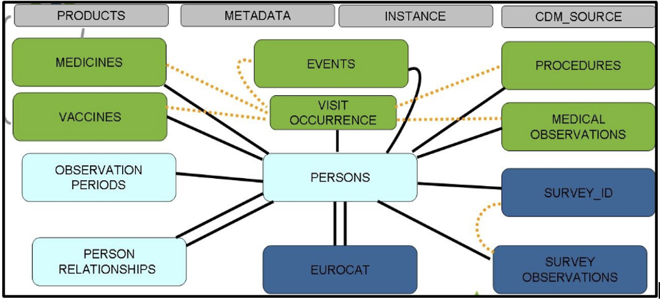
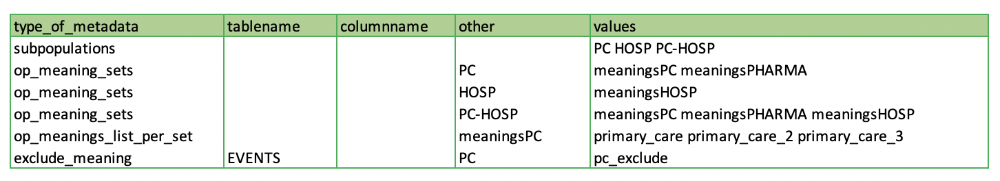

<!-- PROJECT LOGO -->
 

  
  

  
 <h3 align="center">Level 3 checks</h3>
 
 R scripts to produce high-level characterization data to benchmark across DAPs and with external resources. 

 
<!-- TABLE OF CONTENTS -->

  
Table of Contents

  <ol>
    <li>
      <a href="#about-the-project">About The Project</a>
    </li>
    <li>
      <a href="#level-3-checks">Level 3 checks</a>
    </li>
    <li>
      <a href="#getting-started">Getting Started</a>
      <ul>
        <li><a href="#prerequisites">Prerequisites</a></li>
        <li><a href="#installation">Installation</a></li>
        <li><a href="#subpopulation">Subpopulation analysis</a></li>
        <li><a href="#uploading">Uploading results to the online research environment</a></li>
        <li><a href="#links">Data characterization study links</a></li> 
        <li><a href="#version">Current version</a></li>
      </ul>
    </li>
    <li><a href="#license">License</a></li>
    <li><a href="#contact">Contact</a></li>
  </ol>

<!-- ABOUT THE PROJECT -->
## About The Project

[ConcePTION](https://www.imi-conception.eu) aims to build an ecosystem that can use Real World Data (RWD) to generate Real World Evidence (RWE) that may be used for clinical and regulatory decision making. RWE is required to address the big information gap of medication safety in pregnancy.   

ConcePTION is designed to be a learning healthcare system (LHS). In the ConcePTION LHS, we have agreed upon a study-independent syntactically harmonized common data model and aim to assess the quality and fitness for purpose of data in this CDM in a study-independent way (for quality and completeness) and in study design and research question-specific ways (for fitness for purpose).

ConcePTION CDM tables:

  
  

<!-- Level 3 checks -->
## Level 3 checks

**Aims of Level 3 quality checks:**      
**1.**	To perform high-level data characterization of the [ConcePTION CDM]((https://docs.google.com/spreadsheets/d/1hc-TBOfEzRBthGP78ZWIa13C0RdhU7bK/edit#gid=413205035)) instance for each DAP and benchmark across DAPs and with external resources.     
***a.***	Assessing medication use in females of childbearing age and in pregnancy.    
***b.***	Assessing vaccine exposure in females of childbearing age and in pregnancy.   
***c.*** Calculation of incidence rates of events during pregnancy and before/after.             
***d.*** Assessing severity of specific maternal conditions.         
***e.*** Assessing prenatal and antenatal outcomes in relation to drug exposure for signal generation and signal evaluation.     
***f.*** Assessing medication use in the study population.     
***g.*** Assessing vaccine exposure in the study population.

***Level 3 checks will quantify population and person time in each data source for the source and study population as a whole as well as for subpopulations of interest. Examples of this type of check include: counts of codes extracted to identify each event and exposure of interest, counts of medication prescription and vaccine administrations etc.*** 

**The level 3 checks are divided in 8 major steps:**   

1.	Source and study population.   
2.	Medicines.   
3.	Vaccines.   
4.	Diagnoses.   
5.	Pregnancy.    
6.	Populations of interest.   
7.	Health-seeking behaviour and lifestyle factors.   
8.	EUROCAT indicators.   

<!-- GETTING STARTED -->
## Getting Started

Follow the steps below to run Level 3 checks in your data.   

### Prerequisites

R version 4.1.0 (2021-05-18)   

### Installation

1. Download the ZIP folder and extract the contents.   
2. Create a main folder with the name of your project(if you already have done so for Level 1/2 checks skip this step).     
3. Inside the main folder create the folder `Data characterisation`. Put the extracted folder inside.   
4. Inside the main folder create a folder named `CDMInstances`, which will be used to store the .csv files representing the CDM tables(if you already have done so for Level 1/2 checks skip this step).      
5. Inside the `CDMInstances` folder create a folder with the name of your project and inside the latter put all your .csv files(if you already have done so for Level 1/2 checks skip this step).      
6. In the folder `Level_3_checks_to_be_deployed_v1.0`, go to the script 99_path.R and change the variable Studyname(line 6) to the name of your project. Make sure that the name of the folder you have created in the folder `CDMInstances` and the name of the variable match exactly. Save it.         
7. Open the to_run.R script.  

8. If your data source contains a birth registry, in line 13 you need to specify the meaning variable which means birth in your `SURVEY_OBSERVATIONS` table. The example shows `birth_registry_mother`. This variable will be used to select women who gave birth and classify them as having an `end_of_pregnancy` code. iIf you do not have a birth registry, then replace line 13 with the following: `meanings_birth_registry<-c()`.  

9. To run the Lifestyle script a few variables need to be specified. The information needed is the name of the CDM table where you have saved the information(`CDM_table`), the name of the CDM column where this information is stored(`CDM_column`), the original name of your variable(`value`), the CDM variable where the vocabulary (if there is a vocabulary) is saved(`c.voc`), the value of the vocabulary(`v.voc`) and the date variable that stores the date of recording(`v.date`). In line 30 you can find an example of how to fill out this information. The information needed refers to smoking, alcohol abuse, folic acid use, BMI and SES. Please fill out the information in line 39. If no data is available, delete all information about Lifestyle and replace that with `Lifestyle<-list()`. If there is missing information for a particular variable, delete the section regaring that variable and leave the others as they are.

10. After everything is complete, select all by using ctrl+A(Windows) or cmmd+A(Mac) and run.    

***Folder structure***

Main folder

 * [CDMInstances](./CDMInstances)
   * [Project_name](./CDMInstances/Project_name)
     * [files.csv](./CDMInstances/Project_name/files.csv)
     
 * [Data characterisation](./Data_characterisation)
   * [Level_1_checks_to_be_deployed_v5.2](./Data_characterisation/Level_1_checks_to_be_deployed_v5.2)
   * [Level_2_checks_to_be_deployed2.0](./Data_characterisation/Level_2_checks_to_be_deployed2.0)
   * [Level_3_to_be_deployed1.0](./Data_characterisation/Level_3_to_be_deployed1.0)

### Subpopulation analysis

A subpopulation analysis can be performed if your data has different provenance(i.e. different levels of the healthcare system such as hospital data and general practitioner data etc). This analysis helps to identify errors for each specific data sub sample. If you already know that your data quality is similar you can skip this analysis.    

To run the level 3 checks with subpopulation analysis follow the next steps:      
1. Complete the `METADATA` table accordingly. In `type_of_metadata = subpopulations` in the column `values`, add all your subpopulations of interest separated by space. Leave `tablename`, `columnname` and `other` columns empty. Example if you have hospital(HOSP) data and primary care(PC) data you will add `HOSP PC` to the `values` column.     
2. If you want to analyse the overlap between different subpopulations, add first_subpopulation-sencond_subpopulation in `type_of_metadata = subpopulations` in the column `values` Example if you look at the overlap between hospital data and primary care data add `HOSP-PC` to the `values` column.        
3. In `type_of_metadata = op_meaning_sets` in the column `values` specify each meaning set referring to a subpopulation. Separate meaning sets by space In the column `other` add the name of the subpopulation. Leave `tablename` and `columnname` empty. Example if for the primary care data you will add the meaning sets meaningsPC and meaningsPHARMA you will add in the `other` column, `PC` and in the `values` column, `meaningsPC meaningsPHARMA`.      
4. In `type_of_metadata = op_meanings_list_per_set` in the `values` column add all the meanings that should be part of a meaning set and in the `other` column add the name of the meaning set. Leave the `tablename` and `columnname` empty. Example if the meaning set `meaningsPC` contains the meanings primary_care, primary_care_2, and primary_care_3 you will add to the `values` column `primary_care primary_care_2 primary_care_3` and in the `other` column `meaningsPC`. Separate values by space.      
5. If you want to exclude a specific meaning of a CDM table from a subpopulation, add in `type_of_metadata = exclude_meaning` in the column `tablename` the name of the CDM table, in the column `other` the name of the subpopulation and in the column `values` the meanings to be excluded. Separate meanings by space. Leave the `columnname` column empty. Example of you want to exclude the meaning pc_exclude part of the `EVENTS` table from the subpopulation primary care than you will add `EVENTS` to the column `tablename`, `PC` to the `other` column and `pc_exclude` to the `values` column.    
6. You are now ready top run a subpopulation analysis.

### Uploading results to the online research environment

In development.

### Data characterization study links   

[Level 1 checks](https://github.com/IMI-ConcePTION/Level-1-checks): Checking the integrity of the ETL procedure.     
[Level 2 checks](https://github.com/IMI-ConcePTION/Level-2-checks): Checking the logical relationship of the CDM tables.    
[Level 3 checks](https://github.com/IMI-ConcePTION/Level-3-checks): Benchamrking across DAPs and external sources.     

### Current version

The current version of the script is 1.0.

<!-- LICENSE -->
## License

Distributed under the BSD 2-Clause License License. See `LICENSE` for more information.

<!-- CONTACT -->
## Contact

Vjola Hoxhaj - v.hoxhaj@umcutrecht.nl     
Roel Elbers - R.J.H.Elbers@umcutrecht.nl       
Ema Alsina - palsinaaer@gmail.com  

Project Link: [https://github.com/IMI-ConcePTION/Level-3-checks](https://github.com/IMI-ConcePTION/Level-3-checks)

